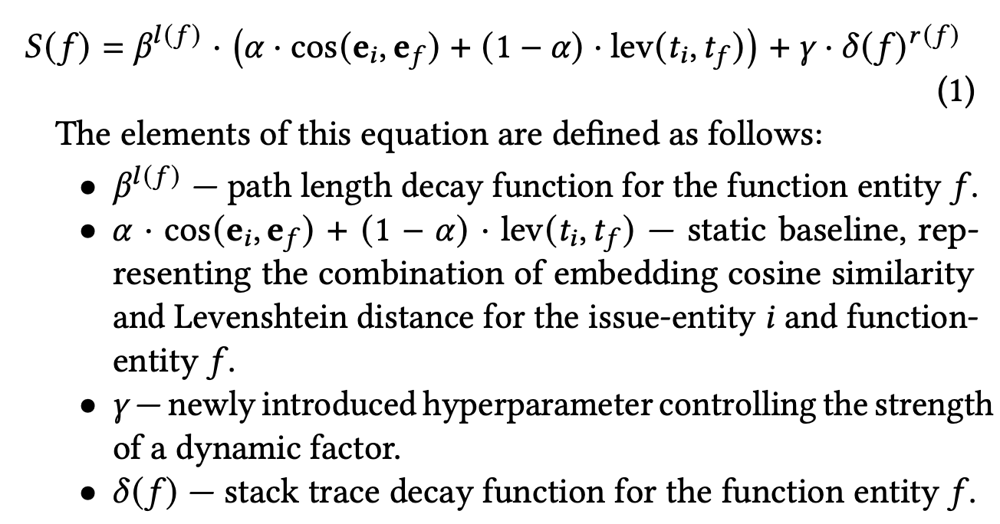
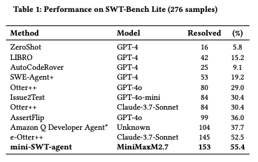
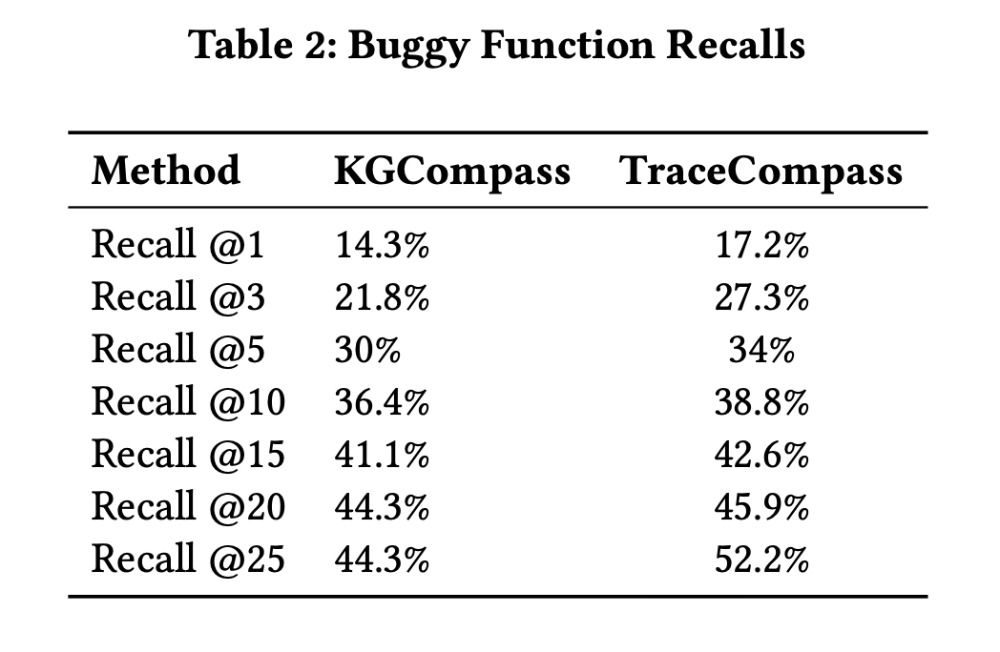

# TraceCompass

TraceCompass extends KGCompass with dynamic execution signals derived from bug-reproducing tests, improving fault localization for automated software repair on SWE-bench.

## How It Works

TraceCompass extends [KGCompass](https://arxiv.org/abs/2503.21710) with dynamic execution signals from bug-reproducing tests. The pipeline runs in three phases:

1. **Test Generation (mini-SWT-agent):** Given an issue and repository, an LLM localizes relevant test and source files, then writes a fail-to-pass (F2P) test; one that fails on the buggy code and passes after the fix.
2. **Stack Trace Capture:** The generated test runs inside Docker under `sys.settrace`, recording the call stack at the first exception and a de-duplicated list of all invoked functions.
3. **Stack-Trace-Augmented KGCompass:** Traces augment KGCompass in two ways: (a) a depth-decayed score term boosts functions near the point of failure, and (b) the 5 shallowest trace candidates are unioned with the top-20 KG candidates to recover buggy functions absent from the graph.



## Results

### SWT-Bench Lite — test generation (276 instances)



### Buggy function recall — SWE-Bench Lite (300 instances)



### Patch resolution — SWE-Bench Lite (300 instances)

| Method | Resolved | % |
|---|---|---|
| KGCompass (baseline) | 104 | 34.6 |
| **TraceCompass** | **122** | **40.7** |

## Layout

```
trace-compass/
├── pipeline.sh                  # Top-level orchestrator: runs mini-SWT-agent then KGCompass
├── setup.sh                     # Installs all dependencies
├── config.env.example           # Template for credentials and runtime config
│
├── mini-swe-agent/              # Modified mini-SWE-agent for test generation and trace capture
│   ├── src/minisweagent/
│   │   └── run/benchmarks/
│   │       └── swebench.py      # process_instance(): test gen + sys.settrace stack capture
│   └── outputs/stack-traces/    # Per-instance trace output (all_calls, exception_frames)
│
├── kgCompass/                   # Fault localization and patch generation
│   ├── kgcompass/
│   │   ├── fl.py                # KG-based fault localization, augmented with trace scores
│   │   ├── llm_loc.py           # LLM-based fault localization
│   │   ├── fix_fl_line.py       # Merges KG + LLM locations, resolves line numbers
│   │   └── repair.py            # Generates patch from final fault locations
│   ├── run_repair.sh            # Orchestrates Steps 1–4 for a single instance
│   ├── playground/              # Cloned repos checked out to base commits for repair
│   └── tests/                   # Run artifacts: patches, locations, logs (gitignored)
│
└── SWE-bench/                   # Upstream SWE-bench evaluation harness (submodule)
```

## Setup

### Prerequisites

- Python 3.10+
- Docker (for SWE-bench evaluation environments)
- A running Neo4j instance (default: `bolt://localhost:7687`)

### 1. Clone the repository

```bash
git clone https://github.com/arvmarandi/trace-compass.git
cd trace-compass
```

### 2. Install dependencies

```bash
./setup.sh
```

### 3. Configure credentials

Copy the example config and fill in your credentials:

```bash
cp config.env.example config.env
```

Then edit `config.env`:

```
MODEL=deepseek/deepseek-v4-flash      # LLM in litellm format
SUBSET=verified                        # SWE-bench subset: "verified" or "lite"
DEEPSEEK_API_KEY=...
GITHUB_TOKEN=...
NEO4J_URI=bolt://localhost:7687
NEO4J_USER=neo4j
NEO4J_PASSWORD=...
PARALLEL=1                             # instances to run concurrently
```

## Running Evaluations

### Single instance

```bash
./pipeline.sh django__django-10914
```

### Full dataset

```bash
./pipeline.sh all             # runs all of SWE-bench Verified
./pipeline.sh all lite        # runs all of SWE-bench Lite
```

### Output

Results are written to `kgCompass/tests/<instance_id>_<model>/`:
- `patches/<instance_id>.patch` — generated repair patch
- `kg_locations/` — KG-based fault locations
- `llm_locations/` — LLM-based fault locations
- `final_locations/` — merged fault locations

Stack traces from test generation are written to `mini-swe-agent/outputs/stack-traces/<instance_id>/`.
